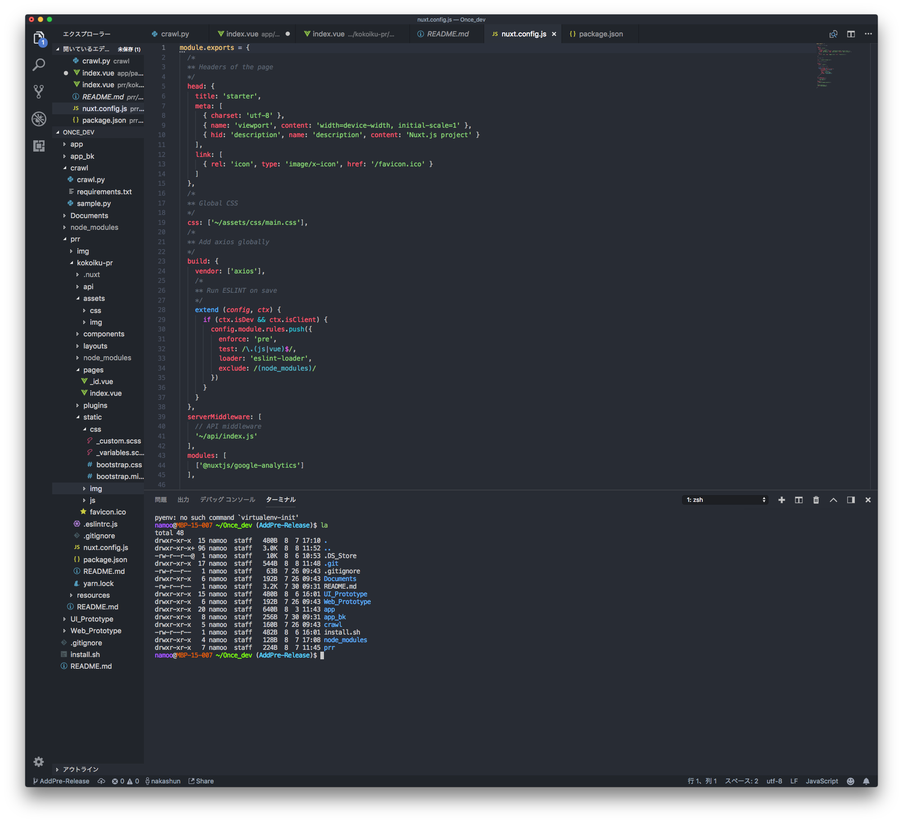
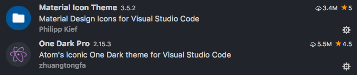
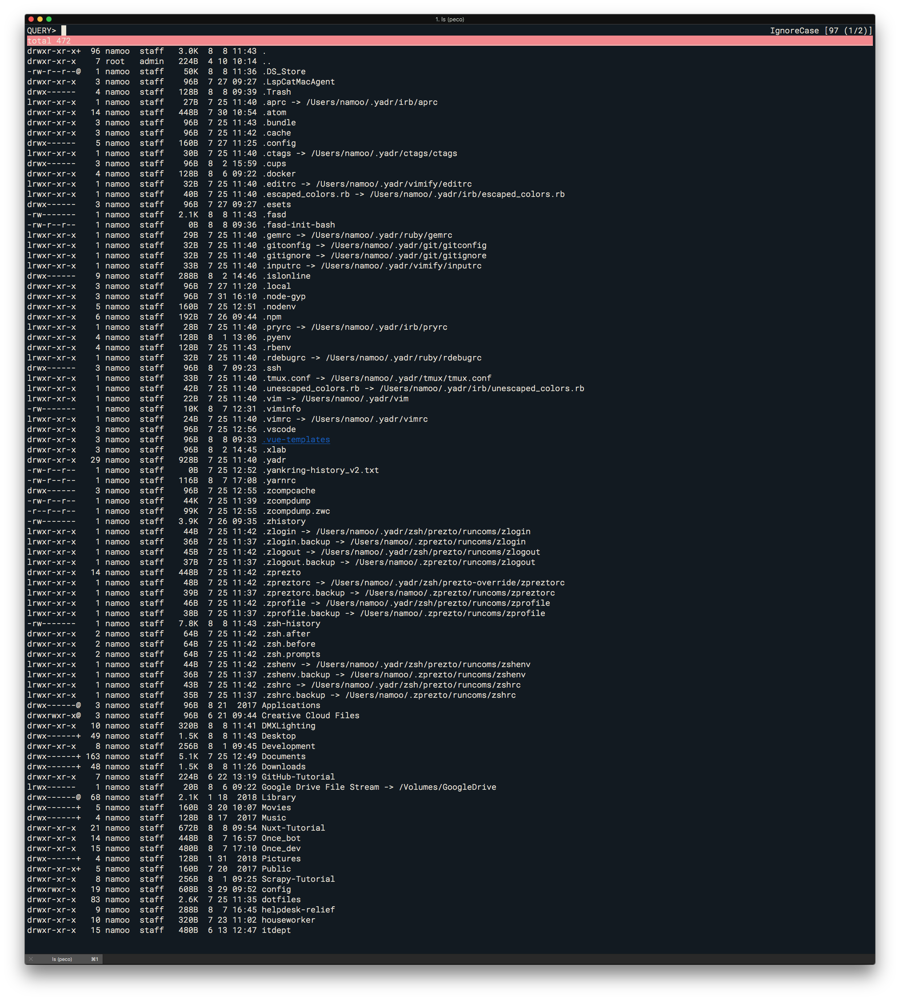

# Development
[MyEnv] Setup for development.

## Environment

[Homebrew](https://brew.sh/index_ja)

[Prezto](https://github.com/sorin-ionescu/prezto)

[YADR](https://github.com/skwp/dotfiles)

## ColorTheme

### iTerm2

[iTerm Color Schemes](https://github.com/mbadolato/iTerm2-Color-Schemes)

### Visual Studio Code

[Material Icon Theme](https://github.com/PKief/vscode-material-icon-theme)

[One Dark Pro](https://github.com/Binaryify/OneDark-Pro)

## Image

### Shell Theme

- Powerline
- Ricty for Powerline

### Peco

- pipe to "peco"

